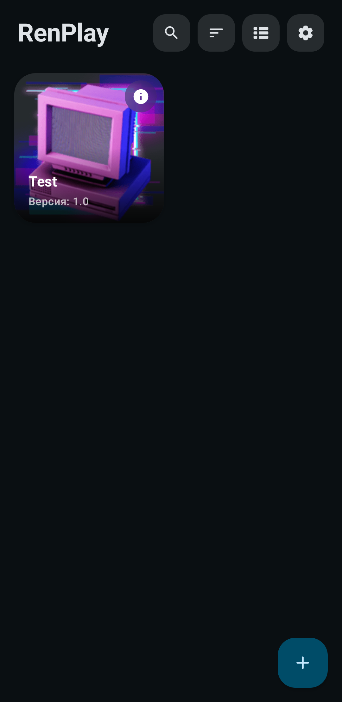
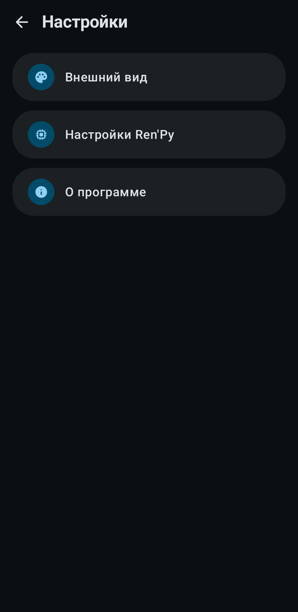
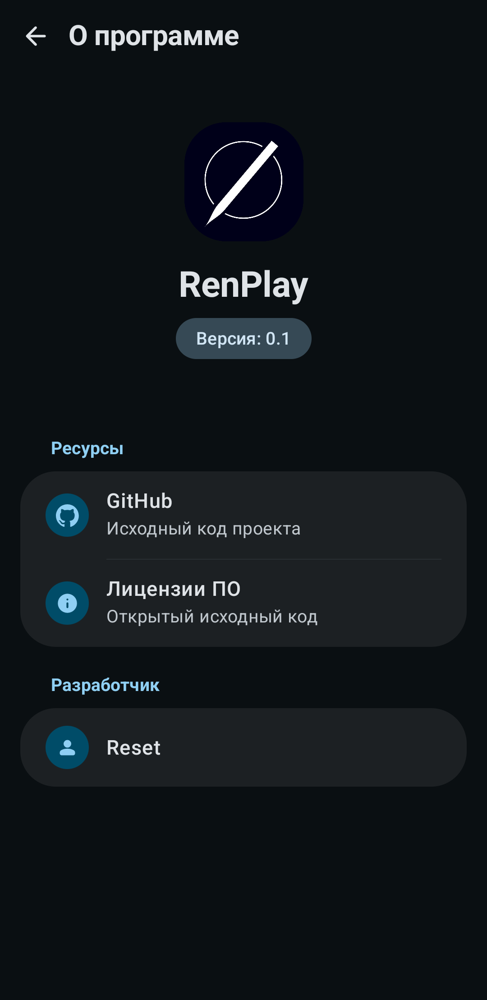

# RenPlay

[](https://www.gnu.org/licenses/gpl-3.0)
[](https://android-arsenal.com/api?level=28)

Android-лаунчер для запуска визуальных новелл на движке [Ren'Py](https://www.renpy.org/). Позволяет запускать игры напрямую из директорий во внутренней памяти устройства.

## Возможности
* Статистика игрового времени.
* Создание ярлыков игр на главном экране.

## Скриншоты
<p align="center">
  
  
  
</p>

## Установка
APK файлы доступны на странице [Releases](https://github.com/Reset171/RenPlay/releases).

## Использование
1. Распакуйте игру на телефон (внутри должна быть папка `game`).
2. В приложении нажмите `+` и выберите эту папку.

## Сборка
Для самостоятельной сборки потребуется JDK 21 и Android SDK (API 34).

1. Клонируйте репозиторий:
   ```bash
   git clone https://github.com/Reset171/RenPlay.git
   ```
2. Создайте файл конфигурации ключей `key.properties` в корне проекта. Для тестовой сборки достаточно указать заглушки:
   ```properties
   keyAlias=debug
   keyPassword=debug
   storePassword=debug
   storeFile=debug.keystore
   ```
3. Запустите сборку:
   ```bash
   ./gradlew assembleDebug
   ```

## Лицензия
Проект распространяется под лицензией [GPLv3](LICENSE). 
В приложении используются сторонние компоненты (SDL2, Python, Ren'Py и др.), их лицензии указаны в разделе "О программе" внутри приложения.